# UMS Application Complete Flow Documentation

## Table of Contents
1. [Application Architecture](#application-architecture)
2. [Request Flow Overview](#request-flow-overview)
3. [Authentication Flow](#authentication-flow)
4. [Authorization Flow](#authorization-flow)
5. [CRUD Operations Flow](#crud-operations-flow)
6. [Database Schema Flow](#database-schema-flow)
7. [Error Handling Flow](#error-handling-flow)

---

## Application Architecture

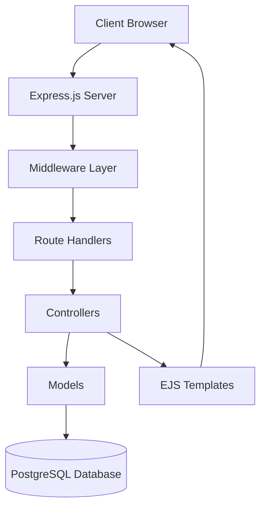

### File Structure
```
UMS/
├── app.js                 # Main application entry point
├── config/
│   ├── database.js        # Database connection
│   ├── jwt.js            # JWT token utilities  
│   ├── setup.js          # Database table creation
│   └── validation.js     # Joi validation schemas
├── controllers/
│   ├── AuthController.js  # Authentication logic
│   ├── UserController.js  # User CRUD operations
│   ├── RoleController.js  # Role CRUD operations
│   └── DashboardController.js
├── middleware/
│   └── auth.js           # Authentication & authorization
├── models/
│   ├── User.js           # User database operations
│   ├── Role.js           # Role database operations
│   └── Permission.js     # Permission database operations
├── routes/
│   ├── auth.js           # Authentication routes
│   ├── users.js          # User management routes
│   ├── roles.js          # Role management routes
│   └── dashboard.js      # Dashboard routes
└── views/                # EJS templates
```

---

## Request Flow Overview

### 1. Basic Request Flow
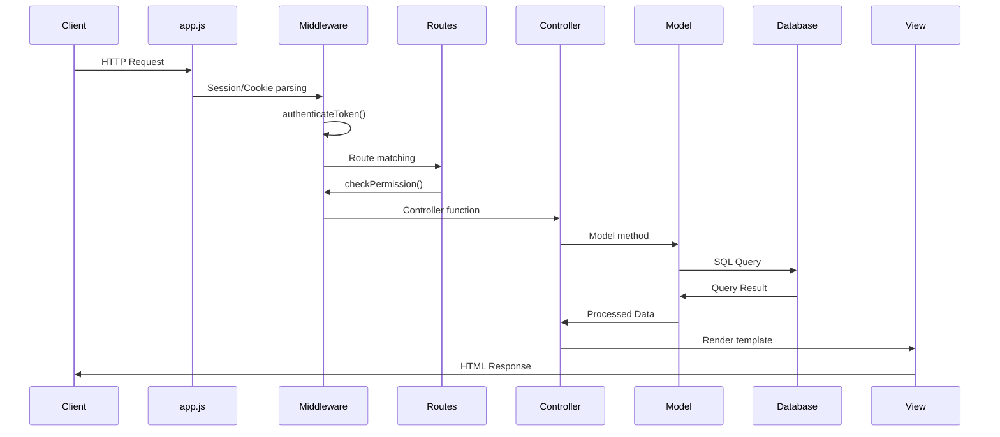

### 2. Express App Initialization Flow
```mermaid
graph TD
    A[app.js starts] --> B[Load environment variables]
    B --> C[Setup middleware stack]
    C --> C1[express.json()]
    C1 --> C2[express.urlencoded()]
    C2 --> C3[express-session]
    C3 --> C4[cookie-parser]
    C4 --> C5[express.static for public files]
    C5 --> D[Setup view engine - EJS]
    D --> E[Mount route handlers]
    E --> E1[authRoutes at /]
    E1 --> E2[dashboardRoutes at /]
    E2 --> E3[userRoutes at /]
    E3 --> E4[roleRoutes at /]
    E4 --> F[Create database tables]
    F --> G[Start server on port 3000]
```

---

## Authentication Flow

### 1. Login Process
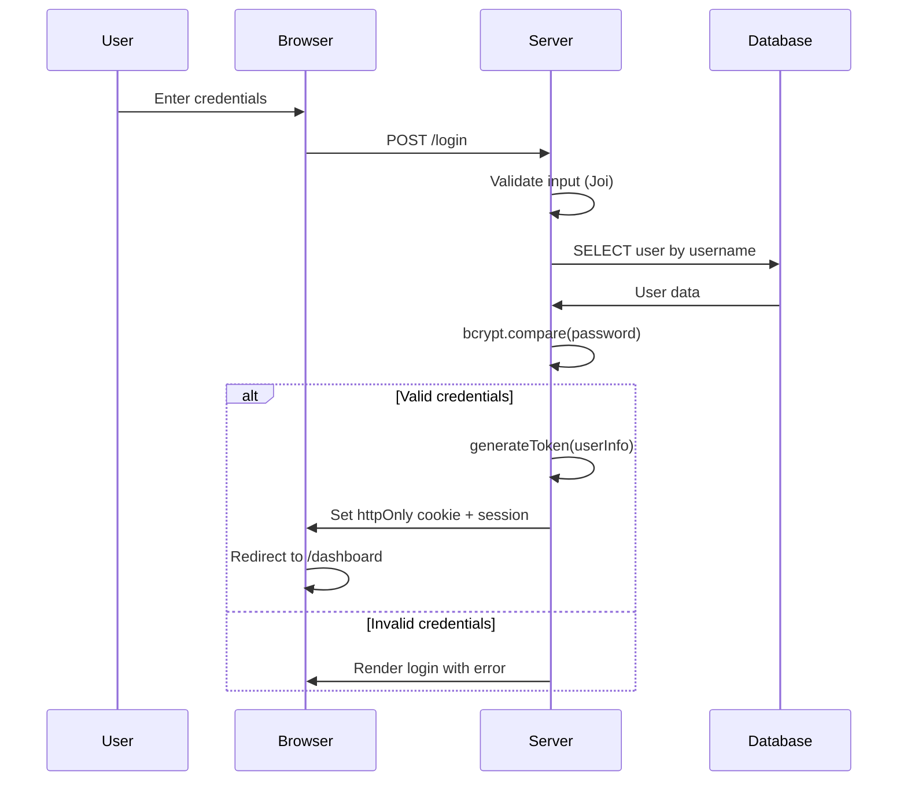

### 2. Authentication Middleware Flow
```mermaid
graph TD
    A[Request arrives] --> B{Token exists?}
    B -->|No| C[Redirect to /login?error=Please login]
    B -->|Yes| D[verifyToken(token)]
    D --> E{Token valid?}
    E -->|No| F[Destroy session + Clear cookie]
    F --> G[Redirect to /login?error=Invalid token]
    E -->|Yes| H[Query database for user + role + permissions]
    H --> I{User exists?}
    I -->|No| J[Destroy session + Clear cookie]
    J --> K[Redirect to /login?error=User not found]
    I -->|Yes| L[Set req.user with permissions array]
    L --> M[Call next() - Continue to route]
```

### 3. JWT Token Structure
```javascript
// Token payload:
{
  userId: 5,
  username: 'john',
  role: 'admin',
  iat: 1640995200,  // Issued at
  exp: 1641081600   // Expires
}
```

---

## Authorization Flow

### 1. Permission Check Middleware
```mermaid
graph TD
    A[checkPermission('edit_user')] --> B[Query database for permission ID]
    B --> C{Permission exists?}
    C -->|No| D[403 Error: Permission not found]
    C -->|Yes| E[Get permissionId from DB result]
    E --> F{req.user.permissions.includes(permissionId)?}
    F -->|No| G[403 Error: Access denied]
    F -->|Yes| H[Call next() - Allow access]
```

### 2. Permission System Architecture
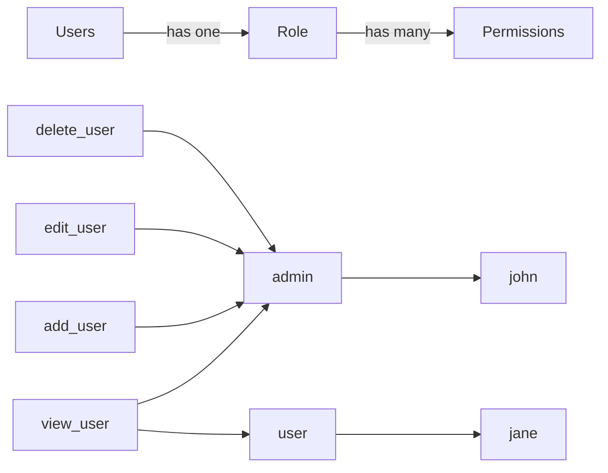

### 3. Database Permission Storage
```sql
-- permissions table
permissions: id | name | description
1 | view_user | View user details
2 | add_user | Add new user
3 | edit_user | Edit user details
4 | delete_user | Delete user

-- roles table  
roles: id | name | permissions
1 | superadmin | {1,2,3,4,5,6,7}
2 | admin | {1,2,3,4}
3 | user | {1}

-- users table
users: id | username | role_id
1 | superadmin | 1
2 | john | 2
3 | jane | 3
```

---

## CRUD Operations Flow

### 1. User Creation Flow (POST /users)
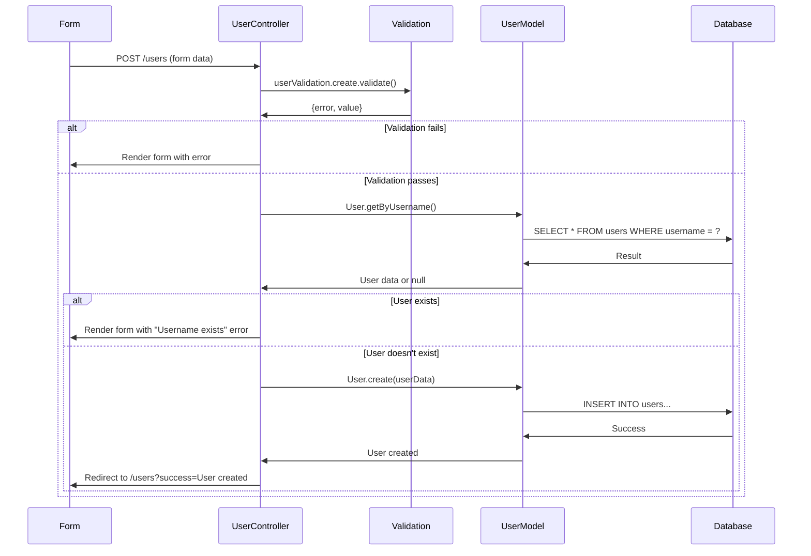

### 2. User Update Flow (PUT /users/:id)
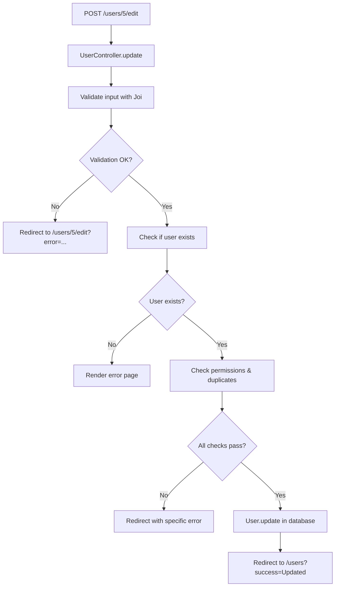

### 3. Role Management Flow
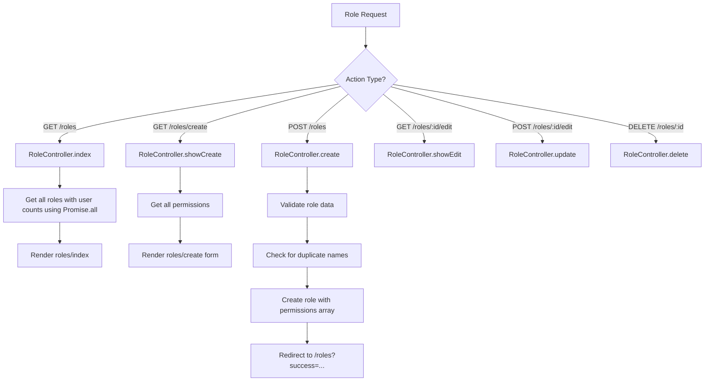

---

## Database Schema Flow

### 1. Database Relationships
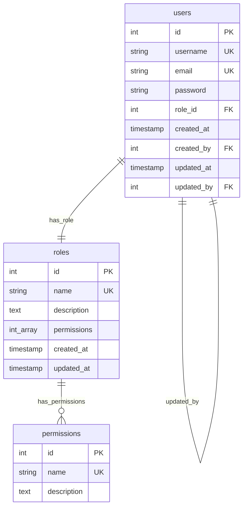

### 2. Database Query Flow
```mermaid
graph TD
    A[Controller needs data] --> B[Call Model method]
    B --> C[Model constructs SQL query]
    C --> D[Execute query via pool.query()]
    D --> E[Database processes query]
    E --> F[Return result rows]
    F --> G[Model processes/formats data]
    G --> H[Return to Controller]
    H --> I[Controller uses data for response]
```

### 3. User Authentication Query
```sql
-- Authentication query in authenticateToken:
SELECT u.*, r.name as role_name, r.permissions 
FROM users u 
JOIN roles r ON u.role_id = r.id 
WHERE u.id = $1

-- Results in req.user object:
{
  id: 5,
  username: 'john',
  email: 'john@email.com',
  role_id: 2,
  role_name: 'admin',
  permissions: [1, 2, 3, 4]  -- Array of permission IDs
}
```

---

## Error Handling Flow

### 1. Error Types and Handling
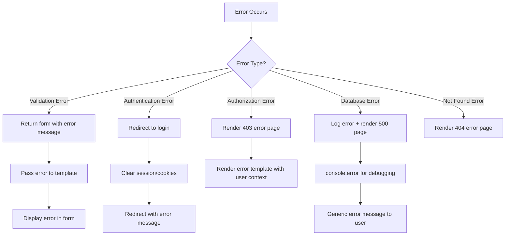

### 2. Form Error Flow (POST-Redirect-GET Pattern)
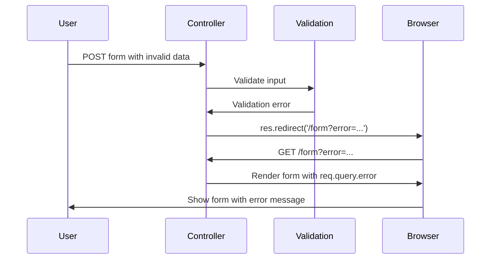

### 3. Error Template Data
```javascript
// All error renders include:
res.render('error', {
    message: 'Error description',
    user: req.user,  // For navigation/context
    // currentPath: req.path || '/'  // Commented out
});
```

---

## Route Protection Flow

### 1. Protected Route Stack
```mermaid
graph TD
    A[Request to /users] --> B[authenticateToken middleware]
    B --> C{User authenticated?}
    C -->|No| D[Redirect to login]
    C -->|Yes| E[checkPermission('view_user')]
    E --> F{Has permission?}
    F -->|No| G[403 Error page]
    F -->|Yes| H[UserController.index]
    H --> I[Render users page]
```

### 2. Route Definition Example
```javascript
// In routes/users.js:
router.get('/', 
    authenticateToken,           // 1st: Check if logged in
    checkPermission('view_user'), // 2nd: Check permission
    UserController.index         // 3rd: Execute controller
);

router.post('/', 
    authenticateToken,
    checkPermission('add_user'),
    UserController.create
);
```

### 3. Middleware Chain Flow
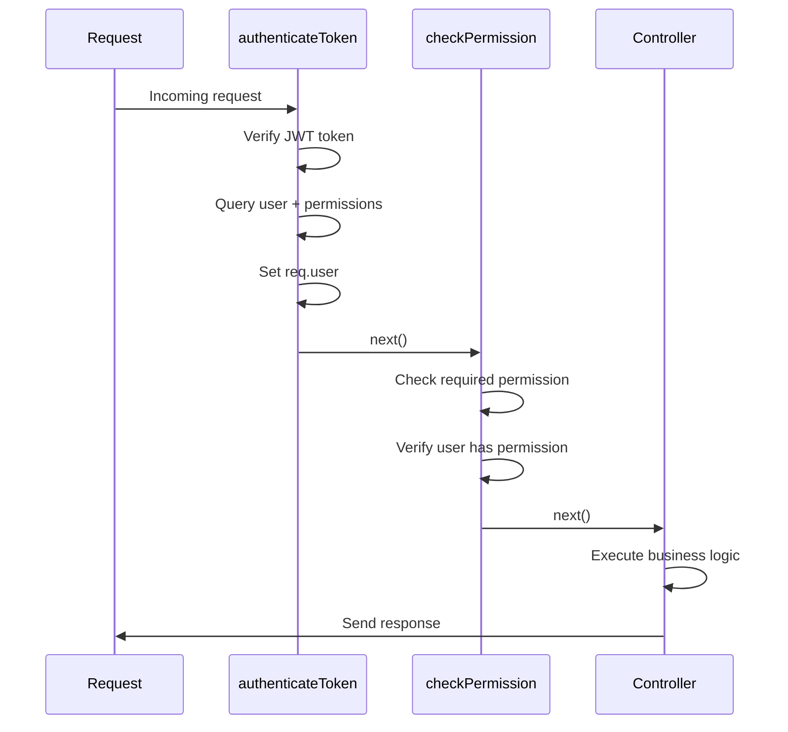

---

## Session and Cookie Flow

### 1. Session Management
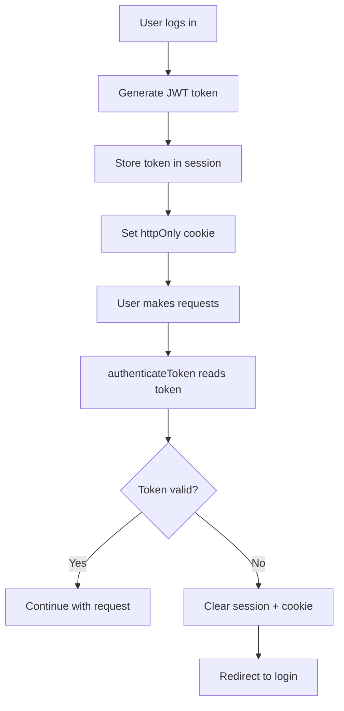

### 2. Cookie Configuration
```javascript
// Cookie settings for security:
res.cookie('token', token, {
    httpOnly: true,        // Prevent XSS attacks
    maxAge: 7 * 24 * 60 * 60 * 1000,  // 7 days
    // secure: true,       // HTTPS only (production)
    // sameSite: 'strict'  // CSRF protection
});
```

### 3. Logout Flow
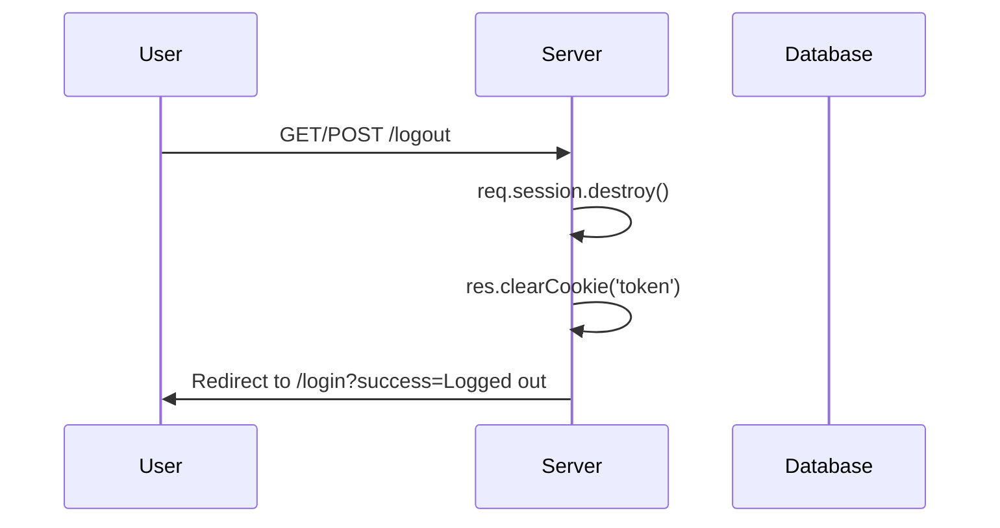

---

## Template Rendering Flow

### 1. EJS Template Flow
```mermaid
graph TD
    A[Controller ready to respond] --> B[Prepare template data]
    B --> C[Call res.render()]
    C --> D[EJS processes template]
    D --> E[Include partials if needed]
    E --> F[Inject data variables]
    F --> G[Generate HTML]
    G --> H[Send to client]
```

### 2. Template Data Structure
```javascript
// Common template data pattern:
res.render('users/index', {
    users: userData,              // Main data
    user: req.user,              // Current user context  
    // currentPath: req.path,    // Navigation (commented out)
    success: req.query.success,  // Success messages
    error: req.query.error       // Error messages
});
```

### 3. Conditional Rendering
```ejs
<!-- Template uses user context for permissions -->
<% if (user && user.role_name === 'admin') { %>
    <a href="/users/create">Add User</a>
<% } %>

<!-- Error/success message display -->
<% if (error) { %>
    <div class="alert alert-danger"><%= error %></div>
<% } %>

<% if (success) { %>
    <div class="alert alert-success"><%= success %></div>
<% } %>
```

---

## Performance Optimizations

### 1. Promise.all Usage
```javascript
// Concurrent database queries for better performance:
const rolesWithUserCount = await Promise.all(
    roles.map(async (role) => {
        const userCount = await Role.getUserCount(role.id);
        return { ...role, userCount };
    })
);

// Instead of sequential (slow):
// for (const role of roles) {
//     const userCount = await Role.getUserCount(role.id);
//     role.userCount = userCount;
// }
```

### 2. Database Connection Pooling
```javascript
// Using connection pool for better performance:
const pool = new Pool({
    host: process.env.DB_HOST,
    port: process.env.DB_PORT,
    user: process.env.DB_USER,
    password: process.env.DB_PASSWORD,
    database: process.env.DB_NAME,
});

// Automatic connection management
// No need to manually open/close connections
```

---

## Security Features

### 1. Security Measures Implemented
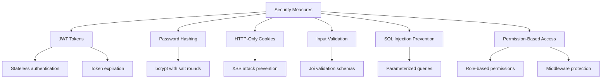

### 2. Validation Flow
```javascript
// Joi validation example:
const schema = Joi.object({
    username: Joi.string().min(3).max(30).required(),
    email: Joi.string().email().required(),
    password: Joi.string().min(6).required()
});

const { error, value } = schema.validate(req.body);
if (error) {
    // Handle validation error
    return res.render('form', { 
        error: error.details[0].message 
    });
}
```

---

This documentation provides a comprehensive overview of how your UMS application works, from the initial request to the final response, including all middleware, authentication, authorization, and database interactions.
